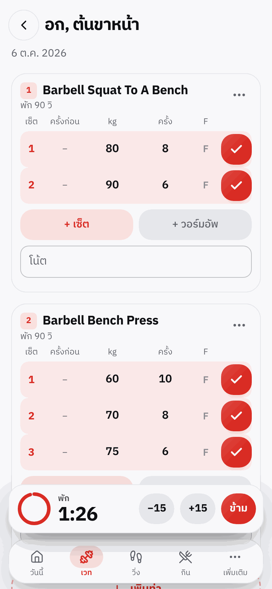

# Gymboy

My own workout log. I use it on my iPhone at the gym to write down every set, add my runs after
the Apple Watch has tracked them, and keep a rough food diary. It's a PWA, so it installs to the
home screen and works offline. Everything stays on the phone: no account, no server.

| Today | Session | More |
| :---: | :---: | :---: |
| <picture><source media="(prefers-color-scheme: dark)" srcset="docs/screenshots/today-dark.png"></picture> | <picture><source media="(prefers-color-scheme: dark)" srcset="docs/screenshots/session-dark.png"></picture> | <picture><source media="(prefers-color-scheme: dark)" srcset="docs/screenshots/more-dark.png"></picture> |

## Features

**Weights**
- Programs with training days, or just start an empty session
- Last time's numbers next to every set, warm-up and failure sets, left/right reps
- Swipe a set to the left to delete it
- Rest timer with a chime and a countdown in the last 3 seconds. It plays over your music without
  stopping it, and if you've been away it shows how long you've gone over
- PR badges, "try more weight" hints, and a history chart for each exercise
- 625 exercises built in (search in English or Thai), and you can add your own
- A body map that lights up the muscles you trained today

**Running**: log a run after the watch, pace worked out for you, interval plans vs what you
actually ran, reusable templates, and shoe mileage.

**Other sports**: badminton or anything else, in minutes. Counts toward workout days.

**Food**: your own food list with kcal and protein, portion sizes, optional photos, daily goals.

**Also**: body weight with progress photos, weekly and monthly summaries, Thai/English, kg/lb,
light/dark theme that follows the phone, full backup and restore, and a JSON export you can paste
into an AI chat.

## Running it

Needs Node.js 18+.

```bash
npm install
npm run dev
```

`npm run dev` also serves on your Wi-Fi, so you can open the Network address on your phone.
Offline mode and Add to Home Screen only work over HTTPS, so try those on the deployed site.

| Command | |
| --- | --- |
| `npm run dev` | dev server on the local network |
| `npm run build` | type-check and build to `dist/` |
| `npm run preview` | serve the build |
| `npm test` | unit tests |
| `npm run test:tz` | tests in a few time zones |

## Deploy

I deploy on Vercel. Import the repo and it picks up Vite on its own (build `npm run build`,
output `dist`). Then on the iPhone: open the site in Safari → Share → Add to Home Screen, and
always open it from that icon. A normal Safari tab can lose its data.

## Data

Data lives in the phone's IndexedDB. Weights are stored in kg and only converted for display, so
switching to lb never changes old logs. Back up from **More → Backup** now and then. It's one
JSON file you can save or share.

## Notes

- The iPhone doesn't let a web app make sound or vibrate while it's in the background, so the rest
  chime only plays while Gymboy is open.
- Exercise names and muscle data come from
  [free-exercise-db](https://github.com/yuhonas/free-exercise-db) (public domain). `scripts/`
  rebuilds `src/data/exercises.json` from it.

## Stack

React 18, TypeScript, Vite, vite-plugin-pwa, Dexie, Tailwind CSS, Recharts, Lucide icons,
IBM Plex Sans Thai.
