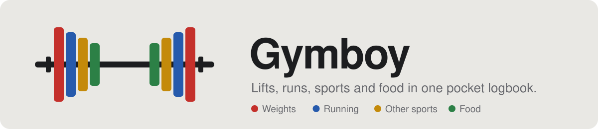
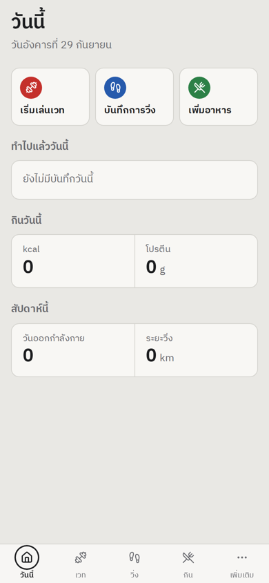
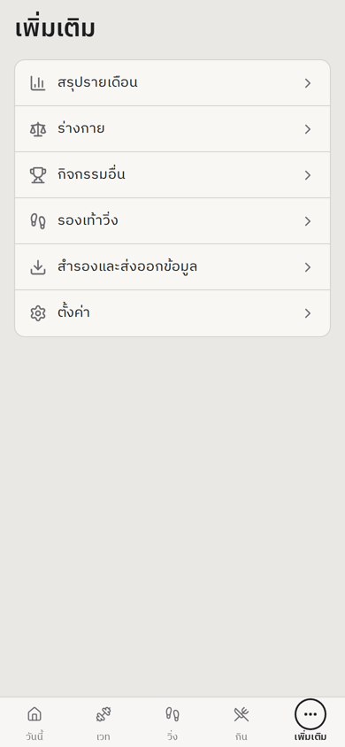
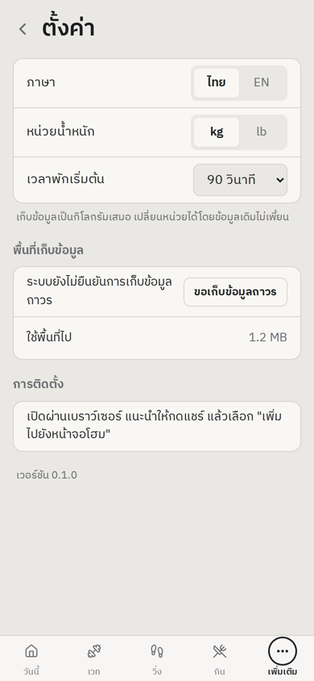

<picture>
  <source media="(prefers-color-scheme: dark)" srcset="docs/banner-dark.svg">
  
</picture>

<p align="center">
  
  
  
  
  
  
  
</p>

<p align="center">
  A personal training log that lives on your phone. Record every set at the gym, type in runs after
  your watch has tracked them, and keep a simple food diary, all offline and without an account.
</p>

<p align="center">
  สมุดบันทึกการออกกำลังกายบนมือถือ บันทึกเวท วิ่ง กีฬาอื่น และอาหาร ใช้งานออฟไลน์ ไม่ต้องสมัครบัญชี
</p>

---

## Screenshots

| Today | More | Settings |
| :---: | :---: | :---: |
| <picture><source media="(prefers-color-scheme: dark)" srcset="docs/screenshots/today-dark.png"></picture> | <picture><source media="(prefers-color-scheme: dark)" srcset="docs/screenshots/more-dark.png"></picture> | <picture><source media="(prefers-color-scheme: dark)" srcset="docs/screenshots/settings-dark.png"></picture> |

Screenshots follow your GitHub theme, just like the app follows your phone's.

## What it does

Each part of the app wears the colour of a competition bumper plate.

| | Area | Highlights |
| :---: | --- | --- |
|  | **Weights** | Saved programs, last session's numbers beside every input, warm-up and failure sets, left/right reps, rest timer, PR badges, "try more weight" hints |
|  | **Running** | Runs typed in after Apple Watch, pace worked out for you, interval plan vs actual per rep, reusable templates, shoe mileage |
|  | **Other sports** | Badminton or anything else, in minutes, counted toward your workout days |
|  | **Food** | A personal food library with kcal and protein, portions, optional photos and daily goals |

Also: body weight with progress photos, weekly and monthly summaries, a body model that lights up the
muscles you trained, full backups, and JSON exports you can hand to an AI coach.

## Roadmap

- [x] **Phase 1** Project setup, installable PWA, database, Thai/English, light/dark theme, Today and Settings
- [ ] **Phase 2** Exercise library, programs, set logging, rest timer
- [ ] **Phase 3** Exercise history, progress charts, PRs, weight-increase hints
- [ ] **Phase 4** Running log, intervals, templates, shoes
- [ ] **Phase 5** Food log, other sports, body weight
- [ ] **Phase 6** Today screen details, weekly and monthly summary, goals
- [ ] **Phase 7** Backup, restore and AI export
- [ ] **Phase 8** Front and back body model with muscle highlighting

## Getting started

You need [Node.js](https://nodejs.org) 18 or newer.

```bash
git clone https://github.com/Audy-Wasawat/GymBoy.git
cd GymBoy
npm install
npm run dev
```

`npm run dev` prints a **Network** address such as `http://192.168.1.20:5173`. Open it on your phone
while it is on the same Wi-Fi to try the layout. Offline use and installing to the home screen need
HTTPS, so try those on the deployed site.

| Command | What it does |
| --- | --- |
| `npm run dev` | Start the dev server on your local network |
| `npm run build` | Type-check and build to `dist/` |
| `npm run preview` | Serve the production build locally |

## Deploy and install on your phone

1. Import this repository on [Vercel](https://vercel.com/new) (or Netlify). It detects Vite; the build
   command is `npm run build` and the output folder is `dist`.
2. **iPhone:** open the https address in Safari, tap **Share**, then **Add to Home Screen**.
3. **Android:** open it in Chrome and choose **Install app**.
4. Always open Gymboy from its home screen icon. An installed app keeps its data; a browser tab can lose it.

## Your data

Everything is stored on your phone in IndexedDB. There is no server and no account. Weights are always
stored in kilograms and shown in kg or lb, so switching units never changes your history. Backups are
JSON files you save through the share sheet (Phase 7).

## Project structure

```text
src/
├── db/          data model (types.ts), Dexie schema and settings (db.ts)
├── i18n/        Thai and English strings
├── lib/         units, local dates with Monday weeks, persistent storage
├── components/  tab bar, page layout, segmented control
└── pages/       Today, More, Settings, placeholders for later phases
docs/            README banner and screenshots
```

## Built with

[React](https://react.dev) · [TypeScript](https://www.typescriptlang.org) · [Vite](https://vitejs.dev) ·
[vite-plugin-pwa](https://vite-pwa-org.netlify.app) · [Dexie](https://dexie.org) ·
[Tailwind CSS](https://tailwindcss.com) · [Lucide icons](https://lucide.dev) ·
[IBM Plex Sans Thai](https://github.com/IBM/plex)
